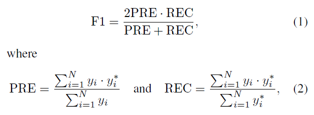
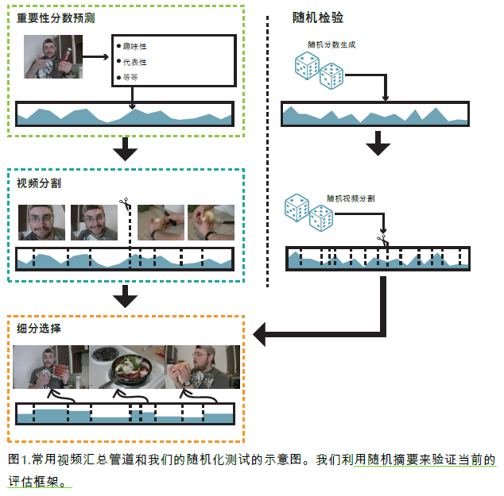
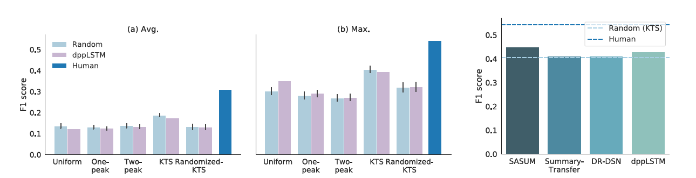
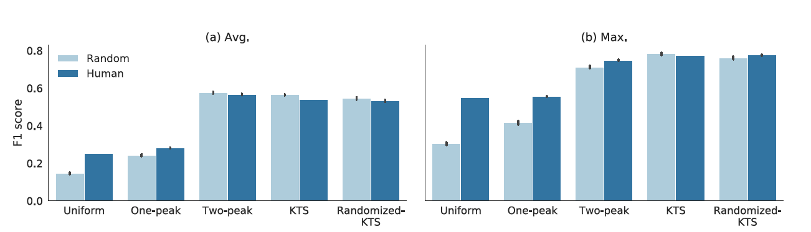
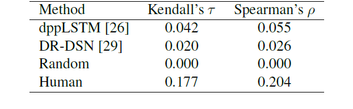
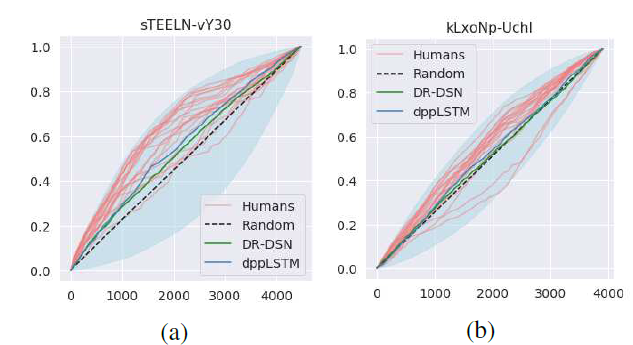
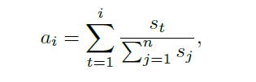

# 论文：重新思考视频摘要的评估

在这篇论文中，作者发现用随机算法来做视频概括任务，其效果可以与世界上现有最好方法（state-of-the-art）相提并论。作者又用人类做的视频概括标注做实验。他们从人类标注中抽取出其中一条，与剩下的标注进行对比计算指标。他们惊奇地发现，在某些情况下，随机算法的效果可以超过人工标注的结果。另有实验表明，视频分割的方式对视频概括任务的结果影响最大。基于以上的观察和问题，作者提出了新的评价指标和可视化方法。

### 视频概括方法流程
目前主流的视频概括方法流程主要包括三步：第一、重要度评估，评估视频每帧的重要度分数；第二、基于帧重要度分数对视频进行分割，将其切成一段段的；第三、视频段选择，根据视频分割和重要度估计结果选择若干段作为视频的概括。

近期主流的评估视频概括结果好坏的手段就是计算人类标注和模型产生的概括之间的重合程度。F1-指标被用来衡量两者之间的重合程度，如下式所示。

PRE表示精确率，REC表示召回率。y_i表示模型产生的概括预测。y_i^*表示人类标注的结果。

### 主流数据集
目前该领域主要有两个数据集，一个是SumMe，另一个是TVSum。前一个数据集包含从YouTube上获取得到的25个视频。每个视频带有15-18个人类标注的视频概括。视频概括包含的视频时间长度小于原时间长度15%。TVSum包含50个YouTube视频。每个视频有标题和类别作为元数据。与上一个数据集不同的是，TVSum在视频中每隔两秒就提供一个重要度分数。

### 随机实验
最新的方法遵循由视频分割，重要性分数预测和视频片断选择组成的范例（左）

本文(右)
在随机实验中，作者使用了随机产生的重要度分数和随机进行的视频分割。具体来说，随机产生重要度分数就是独立地等概率地从[0,1]中抽取一个小数。对于随机的视频分割，作者采用了一下方法：

1. 均匀分割，按时间等分；

2. 从单峰分布随机抽取一个数，作为某一视频段的帧数。

3. 从双峰分布中随机抽取一个数，作为某一视频段的帧数。

4. 画面变化分割（kernel temporal segmentation， KTS），选择视频画面变化剧烈的时间点作为视频分割处。

5. 随机画面变化分割（randomized KTS），用KTS方法分割后，将分割点随机排列，但是视频内容顺序不变。于是分割结果中视频段长度分布不变，但是每段中的视频内容与KTS结果不同。

### 贡献
• 评估了当前基于参考摘要的评估框架的有效性，并揭示了一种随机
dppLSTM 方法能够达到与当前最新技术类似的性能得分。

• 证明广泛使用的F1分数主要由视频片段长度的分布决定。文章分析为这种现象提供了简单的解释。

• 演示了使用预测的排序与人工注释者的排序之间的相关性来评估重要性排名。此外，提出了几种可视化方法，可以洞悉预测得分与随机得分。

### 人类标注实验
从每段视频的所有人类标注中随机抽取一个作为模型做视频概括的结果。仍旧将剩余的人类标注作为参考结果。将抽取出来的一条与其他进行比对，计算指标。

###实验结果

如上图所示，随机实验的F1值与目前最好的模型不相上下。有时，KTS的实验结果甚至好于最好模型的结果。

如上图所示，随机实验的结果在个别情况下甚至好于人类标注的结果。

### 新的评估框架
作者使用重要度大小排序与人类标注重要度的排序结果的相关性来评估模型预测结果的好坏。具体来说，就是先将每帧分别按照模型预测的重要度和人类标注的重要度从大到小排序。然后用Kendall秩相关系数和Spearman相关系数来评估两个排序结果的相关程度。相关程度越高，模型预测结果越好；相关程度越低，模型预测越差。

从上表可以看出，作者提出的评估方法充分拉开了现有模型和随机实验之间的差距，也来开了人类标注和现有模型之间的差异。

### 新的可视化方法

上图就是作者提出的新的可视化方法。具体来说，就是首先计算每帧的人类标注的平均重要度分数。然后根据平均重要度分数从大到小对帧进行排序。接着根据这个排序结果，按照来计算序列中每帧的标准化分数。这里s_i表示第i帧用某种方法预测的重要度。最后以排序结果为横坐标，以计算得到的a_i作为纵坐标画出上图。
