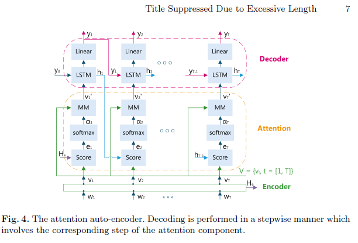

# videosum
# 1.深度强化学习用于无监督的视频摘要多样性代表性(DR)
#### 无监督视频摘要
#### 将视频摘要表述为一个顺序决策过程，并训练一个深层的摘要网络，以通过强化学习来产生各种具有代表性的视频摘要

## DSN具有编码器-解码器体系结构
- 编码器是对视频帧执行特征提取的卷积神经网络（CNN），
- 解码器是双向LSTM网络，它会根据采样的动作来选择帧，从而产生概率
- 数据集SumMe和TVSum->标准的5倍交叉验证（5FCV），即80％的视频用于培训，其余的用于测试。

本文贡献是：
- 到端+基于强化学习框架具有多样性代表（DR）奖励功能

   奖励函数由多样性奖励和代表性奖励组成。

   分集奖励衡量所选帧之间的相异程度
- 代表性奖励则计算帧与其最近的所选帧之间的距离-k值问题
- 将无监督的方法扩展到有监督的版本以利用标签。对数概率最大化
## 拟议方法
通过强化学习来训练深度汇总网络（DSN）。DSN收到视频V i并采取措施视频的一部分被选择为摘要S的A（即二进制变量序列）。反馈奖励R（S）基于摘要的质量（即多样性和代表性）来计算。

## 深度汇总网络
DSN中
编码器是卷积的提取视觉特征向量的神经网络（CNN）从输入视频帧。
解码器是双向递归神经网络（BiRNN）顶部带有完全连接（FC）层。
以S形函数结尾的FC层为每个帧预测概率pt，从中采样帧选择动作
## DR
Rdiv计算为所选帧之间成对差异的平均值

Rrep视频帧与其最近的帧之间的平方误差最小均值

## 政策梯度(不了解)
## 正则化
对概率分布施加正则化项DSN产生的p1：T限制了为摘要选择的帧的百分比
## 优化
stochas-优化策略函数的参数θ基于tic梯度的方法。
## 扩展到监督学习
给定视频的关键帧索引，Y ∗ = {y ∗ i | i =1，...，| Y ∗ |}，使用最大似然估计（MLE）以最大化选择的对数概率由Y ∗指定的关键帧，log p（t;θ）其中t∈Y ∗
## 摘要的镜头
通过最大化总得分来选择镜头，而
确保摘要长度不超过限制，
通常是视频长度的15％。
步骤本质上是0/1背包问题，即
被称为NP-hard问题（百度）
## 实验比较

- 设定基准模型和那些只接受Rdiv和Rrep训练的人一样分别由D-DSN和R-DSN表示。我们代表
该模型将两种奖励一起训练为DR-DSN。
扩展到监督版本的模型表示为
由DR-DSNsup。验证了
拟议的技术（称之为“技术”
on）在计算Rdiv时忽略了遥远的相似性。
将未经技术培训的D-DSN表示为
D-DSNw / o

# 2.对抗性LSTM网络的无监督视频汇总

## 用作无监督视频摘要的基准

关键思想是学习一个深入的摘要器网络以最大程度地减少训练视频与发布之间的距离以无人监督的方式总结它们的摘要
## 新的生成对抗框架-摘要器和鉴别器
- 摘要器是自动编码器长短期记忆网（LSTM），选择视频帧，然后解码获得的用于重建输入视频的摘要
- 鉴别器是另一个LSTM针对原始视频，并从汇总程序的重建之间的区分。
## 文章运用到的模型
- 变体自动编码器（ VAE）[[16] D. P. Kingma and M. Welling. Auto-encoding variational
bayes. ICLR, 2014.]是一个有向图模型，在给定一个未观察到的
潜在变量的情况下，它定义了观测数据的后验分布。
- 生成对抗网络（ GAN）[ [8] I. Goodfellow, J. Pouget-Abadie, M. Mirza, B. Xu,
D.Warde-Farley, S. Ozair, A. Courville, and Y. Bengio. Generative
adversarial nets. In NIPS, pages 2672–2680, 2014]是由两个相互竞争的子网组成的神经网络：i）
一个“生成器”网络（G），它生成模仿未知分布的数据； ii）一个“鉴别器”网络
（D），用于区分生成的样本和来自以下样本的样本真实的观察。目的是要找
到一个生成器，该生成器在分配鉴别器犯错误的可能性最大化的同时，确定真
实的数据分布。
## 步骤
- 任务：给定一个视频，在没有关键帧的标注下，选取关键帧。

- 先验：关键帧的分布应该与原序列的分布一直（去除冗余信息）

- 正规化：关键帧的个数应该尽可能的少。

  关键帧的信息尽可能离散。
- 做法：

  slstm：输出每一帧的得分，与原来帧加权后得到新的特征。
 
  elstm：对于lstm得到的特征编码，得到一个特征。
 
  dlstm：对elstm得到的特征解码，恢复出原来的特征。
 
  clstm：判断dlstm得到的特征是否还是原来的特征。

- 处理：根据每一帧的得分选出关键帧。

  将视频分成不重叠的几个clip。
  
  每个clip的得分是这个clip中所有帧的得分的平均，对clip排序。
  
  高得分的clip中的帧按照分数排序，选出最高的几帧。

## 与原paper相比的变化
- 视频特征提取器
     - GoogleNet pool5（1024）=> ResNet-101 pool5（2048）
     - 随后线性投影至500-dim
- 稳定的GAN训练
     - 鉴别者的学习率：1e-5（其他人：1e-4）
     - 在每个时期的前15个步骤中修复鉴别器的参数。
## 模型特征

- （a）概述：我们的目标是选择关键帧，以使所选关键帧的特征表示与
视频之间的距离最小。
- （b）由于很难指定深层特征之间的合适距离，因此我
们使用了生成对抗性框架来优化帧选择器。我们的方法包括一个可变自动编码
器和一个生成对抗网络。

图2：主要组成部分：选择器LSTM（sLSTM）从输入序列中选择
帧的子集 X。 编码器LSTM（eLSTM）将选定的帧编码为固定长度的特征 e，
然后将其转发给解码器LSTM（dLSTM），以重建视频

我们训练中使用的四个损失函数。 LGAN是增加的GAN损耗，Lreconst是循环编码器/解码器的重建损耗。 在训练中，我们使用
由先验分布（例如，均匀）控制的附加帧选择器sp，其产生编码表示
ep和重建的特征序列^ xp。 对cLSTM的对抗训练经过了正规化处理，因此在将^ xp识别为“摘要”时非常准确，但是却将^ x识别为“原始”。

## 算法

其中为了GAN模型训练相似，制定了一种对抗学习算法，该算法迭代地优化了以下三个目标：
- 学习{s，e}；最小化
（Lreconst + Lprior + Lsparsity）。
- 为了学习{d}，最小化（Lreconst + LGAN）。
- 为了学习{c}，最大化LGAN。

## 正则化（三种比较）
- 摘要长度正则化 SUM-GAN
- 基于DPP的正则化 SUMGANdpp
- 关键帧正则化 SUM-GANsup

## 数据集
SumMe ，TVSum，打开视频项目（OVP）和Youtube

将谐波平均F分数用作评估指标。将帧级别的分数
转换为关键帧和关键镜头摘要，反之亦然。为了为仅提供关键帧分数的数据集
生成关键镜头，使用KTS将视频最初在时间上分割为不相交的间隔。
根据间隔的重要性评分对所得间隔进行排序，其中间隔的重要性评分等于该间
隔中帧的平均评分。从排序的间隔中选择一个间隔子集作为关键帧，以使生成
的关键帧的总持续时间小于 15％ 原始视频的时长。

# 3.通过注意力驱动的对抗学习进行无监督的视频汇总（2020）
基于SUM-GAN模型，提出架构SUM-GAN-sl（减少了参数数量，以增量方式更新模型的组件，并遵循基于标签的逐
步方法来训练对抗部分。

## 贡献
- 在无监督的学习框架中引入注意机制，而以前所有基于注意的摘要方法均受到监督；
- 使用注意力来指导模型的生成对
抗训练，而不是使用它对视频片段进行排名。fa'fa

## 内容
以上一篇为起点做的，通过最小化原始视频的深层特征表示与其基于所选关键帧的重构版
本之间的距离来选择视频关键帧

- 在模型的变体自动编码器中直接引入关注层（SUM-GAN-VAAE）
- 用确定性关注自动编码
器（SUM-GAN-AAE）替换此组件。在SumMe和TVSum数据集上进行的实验记录了与原始
SUM-GAN模型相比所取得的改进，显示了变化注意力不能增强体系结构的训练能力，突出了注意力自动的贡献
-encoder可以更快，更稳定地训练模型，并展示提出的SUM-GAN-AAE体系结构与最新技术的竞争力。

相对于所利用的损失用于训练模型，Lrecon, Lprior and
Lsparsity的计算（第二篇)。但是，不是使用L GAN损失SUM-GAN模型，采用基于标签的方法，其中标签“ 1”表示原始视频，并将视频摘要标记为“ 0”
:LGEN = (1 - p(^x))^2

L GEN 用于最小化均方误差（MSE）在原始视频标签和为重建视频分配的概率之间视频。

L ORIG 用于最小化原始视频标签与为原始视频分配的概率之间的MSE视频，而L SUM用于最小化摘要标签和为基于摘要的视频重建分配的概率

在对视频进行分段之后使用KTS算法（同二），片段级重要性分数是通过将每个分数的平均值进行计算片段的帧

## 注意力机制
左原始VAE变化为右变式注意力自动编码器AAE（建模都是高斯分布随机变量）

s t，t∈[1，T]是指帧选择器计算出的重要性得分，w t，t∈[1，T]对应于它的加权特征向量（S t ⊗x't，其中⊗表示传递给注意力自动编码器的逐元素矩阵乘法），ˆx t，t∈[1，T]表示重构的特征向量

AAE模块 ：
接收编码器的输出V = {ν t，t∈[1，T]}

解码器的先前隐藏状态h t-1

计算注意力能量矢量e t（表示t th之间的相关性视频的帧和整个视频帧集，使用计分功能）

应用soft-max函数来规范注意力产生注意力权重向量a t的能量（由ei归一化计算）

## 数据集
SumMe TVSum数据集

计算F值（自动创建的（A）与用户摘要（U）之间的相似性由F分数（以百分比表示）计算）

# 4.自我注意机制视频汇总
一个简单的，基于自我关注的网络，用于视频摘要，该网络在训练过程中以单前馈和单后馈方式执行整个序列到序列的变换（监督）

无需重复网络（例如基于LSTM的编码器-解码器模型）即可执行序列到序列的转换

提出一个纯粹的attention，序列网络VASNet视频按键摘要，并展示其在TvSum和SumMe基准。该模型的体系结构不采用循环使用或顺序处理，可以用常规矩阵/向量实现操作，并在推理/训练过程中一次向前/向后运行，即使是长度可变的序列。

该架构围绕两个中心关键操作:注意力权重计算和框架水平得分回归

## 贡献

1.一种基于软性，自注意力机制的视频摘要的序列到序列转换的新方法。相反，当前的技术水平依赖于复杂的
LSTM / GRU编码器-解码器方法。

2.演示了可以用更简单的视频摘要关注机制成功替换循环网络的情况。

## 注意模型
- 硬性
- 软性（本文采用,注意模型未考虑解码器状态，则该模型称为自我注意或内部注意。对于整个序列，单次通过矩阵乘法即可计算自注意力)
## 模型架构
参数解释：
模型采用了放置序列X =（x 0，...，x N），x∈R D并产生输出序列Y =（y 0，...，y N），y = [0，1），长度均为N。输入是一个序列为每个视频帧提取尺寸为D的CNN特征向量

未归一自我注意权重e t，N是视频帧的数量，U和V是网络权重矩阵 s 是一个比
例参数（实验得到取得0.06)

注意力向量e t转换为关注权重α t(真实的概率，当时输入特征相对于所需帧级别得分的重要性 t)与SOFTMAX

线性将变换C应用于每个输入，然后对结果进行加权与关注矢量α t并取平均值。输出是一个上下文矢量c t其用于最终帧得分回归。

随机失活（dropout）是对具有深度结构的人工神经网络进行优化的方法，在学习过程中通过将隐含层的部分权重或输出随机归零，降低节点间的相互依赖性（co-dependence ）从而实现神经网络的正则化（regularization），降低其结构风险

由单层完全连接的网络投影上下文向量c t具有线性激活和残差总和。C和W是在网络训练期间学习的网络权重矩阵

由两层神经网络执行框架得分回归y t = m（k t）。第一层具有ReLU激活，然后是dropout和分层归一化，而第二层具有一个具有S形的隐藏单元激活。

## 帧分数到关键摘要
- 检测场景更改点，每
个场景更改点代表一个潜在的按键片段
- 同之前处理：通过将这些摘要中的总帧得分最大化，同时将总
摘要长度限制为原始视频长度的15％，来选择这些摘要的子集。

KTS算法

训练：deopout=0.5 epoch=200 L2 =10-5正则化

为了评估机器摘要和用户摘要之间的相似性，我们使用精度的谐波平均值和以百分比形式表示为F分数的召回率。

# 想法
## 无监督方法
(按照论文中的看点，监督学习无法充分探索深度网络在视频摘要中的潜力，因为不存在视频的单个事实摘要。这是基于以下事实：人们对应该选择视频的哪些部分作为摘要有主观意见。)

##### 可以在SUM-GAN模型上进行改进参数或者引进某个新的机制（第一篇是DR机制，二是不清楚，三是注意力机制）来计算精确度
看看SumMe TVsum 使用方法和内容
